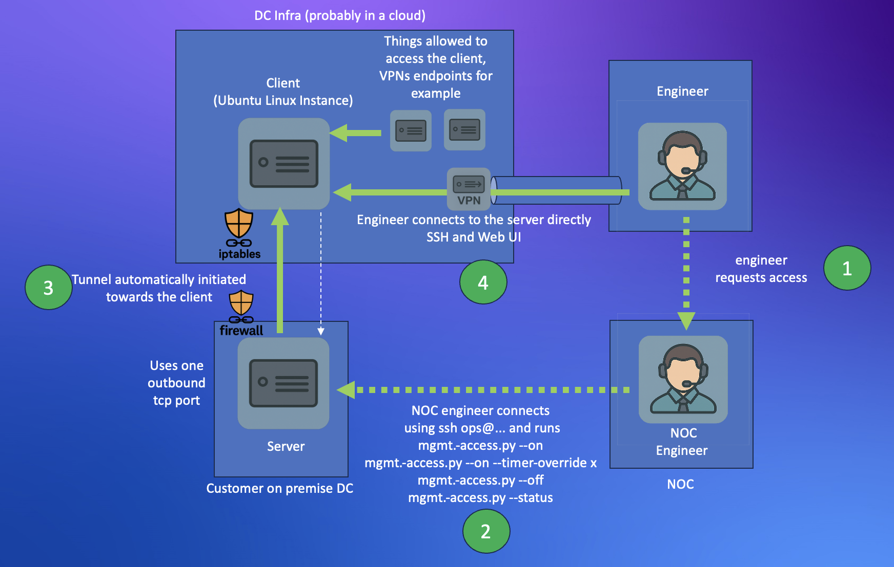

## What is Remote management TSA:




* A client server tool which provides MGMT access on demand, without using any inbound ports. It is written in line with TSA regs Managagement access requirements. 
* The tool runs on Ubuntu Linux 
* The created ops user is locked down, only able to run mgmt-access.py 
* The install options are automated and will prompt you for the configuration values

```
#help
python3 mgmt-access.py --help

#install the server (where the reverse ssh service will be started and stopped by ops user)
#this can be ran safely on a DCU
pip install -r ./requirements.txt
python3 mgmt-access.py --install-server
python3 mgmt-access.py --add-ops-user  

#install the client instance: this is a minimal ubuntu 24.04 + ssh, one ip is enough. 
python3 mgmt-access.py --add-ops-user  
python3 mgmt-access.py --install-client

#start the remote mamagement service for 24 hours, usually ran by the ops user
python3 mgmt-access.py --on 

#start the remote management service for the specified number of hours 
python3 mgmt-access.py --on --timer-override 99 

#start the remote management service, run untill manually stopped with --off 
python3 mgmt-access.py --on --timer-override 0 

#stop the remote mamagement service, usually ran by the ops user
python3 mgmt-access.py --off

#remove the ops user
python3 mgmt-access.py --remove-ops-user

#status (the status output will change when it is ran on a server vs a client)
python3 mgmt-access.py --status

#detailed status 
python3 mgmt-access.py --status --log-level DEBUG

#uninstall the server
python3 mgmt-access.py --uninstall-client

```

